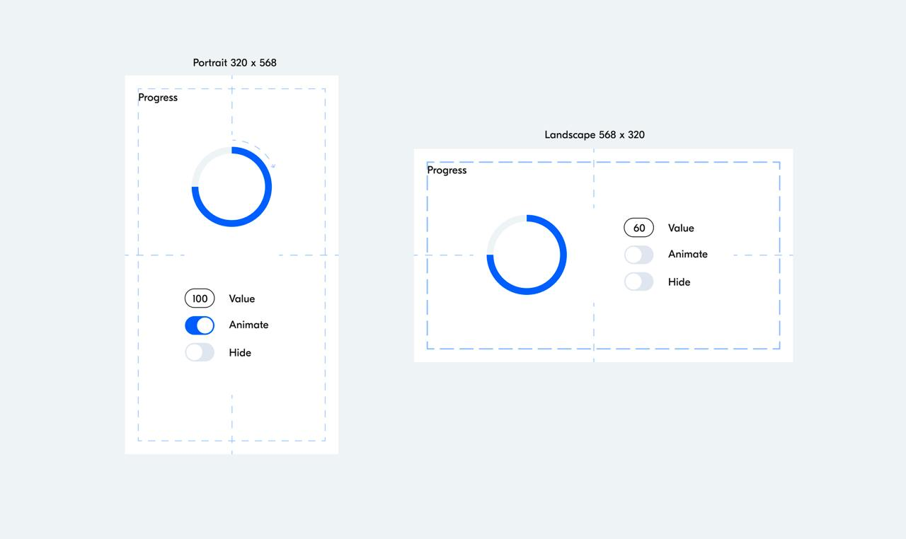

# Тестовое задание

## Реализовать блок Progress

Задача
Разработать прототип блока Progress для использования в мобильных web-приложениях.
Основное предназначение блока отображать процесс выполнения процессов и их прогресс
выполнения.

Особенности

- Блок должен иметь API для управления его состоянием.
- Блок должен быть спроектирован так, чтобы его было легко переиспользовать в
  других приложениях.
- Состояния:
  - **Normal** – базовое состояние, в котором путём задания _Value_ можно управлять
    размером дуги, отражающей некоторый параметр или прогресс процесс. Начало
    дуги соответствует 12 часам, конец дуги при увеличении параметра _Value_
    движется по направлению часовой стрелки и достигает начала при значении 100.
  - **Animated** – независимое состояние, при котором блок или его элементы
    начинают вращаться с некоторым периодом по часовой стрелке.
  - **Hidden** – состояние скрывающее блок со страницы.
- Результат выполнения задачи должен быть представлен в виде небольшого
  приложения с элементами управления ( _Value_ – текстовый ввод числа от 0 до 100,
  _Animate_ и _Hide_ – логические переключатели on / off, см. Макеты ).
- Приложение должно быть адаптирующимся под ориентацию экрана – будет большим
  плюсом.
- Фиолетовые штрихпунктирные линии – вспомогательные линии для облегчения
  вёрстки.

Технологии

- JS (без jQuery и других библиотек / фреймворков, упрощающих и дополняющих
  функциональность окружения браузера).
- CSS или любые другие пре/постпроцессоры.
- HTML (без использования шаблонизаторов).

Примечания к выполнению
Задача считается выполненной, если её можно открыть на телефоне по публичной ссылке на https://pages.github.com/

Макеты

